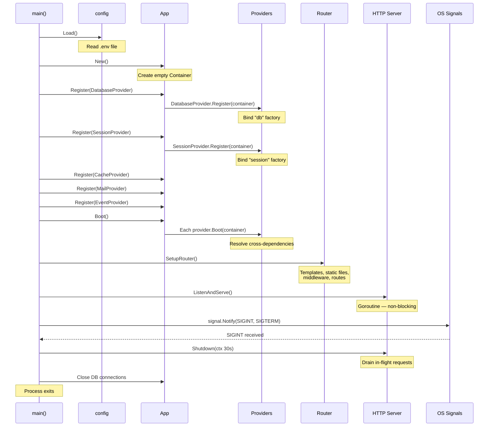

# Application Lifecycle

## Abstract

This document describes the complete boot-to-shutdown sequence of the
framework. It covers configuration loading, service provider registration
and booting, router setup, HTTP server startup, and graceful shutdown.

## Table of Contents

1. [Terminology](#1-terminology)
2. [Lifecycle Overview](#2-lifecycle-overview)
3. [Boot Sequence (Detailed)](#3-boot-sequence-detailed)
4. [Complete main.go](#4-complete-maingo)
5. [Graceful Shutdown](#5-graceful-shutdown)
6. [Sequence Diagram](#6-sequence-diagram)
7. [Security Considerations](#7-security-considerations)
8. [References](#8-references)

## 1. Terminology

The key words "MUST", "MUST NOT", "REQUIRED", "SHALL", "SHALL NOT",
"SHOULD", "SHOULD NOT", "RECOMMENDED", "MAY", and "OPTIONAL" in this
document are to be interpreted as described in [RFC 2119].

- **Boot** — The phase where all service providers are initialized and
  cross-service dependencies are resolved.
- **Graceful Shutdown** — The process of stopping the server while
  allowing in-flight requests to complete.

## 2. Lifecycle Overview

The application follows a linear lifecycle with 9 stages:

```text
1. config.Load()         ─── Read .env file
2. app.New()             ─── Create application container
3. Register providers    ─── Bind service factories into container
4. Boot providers        ─── Resolve cross-dependencies
5. SetupRouter()         ─── Configure routes + middleware
6. ListenAndServe()      ─── Start HTTP server
7. Signal wait           ─── Wait for SIGINT / SIGTERM
8. srv.Shutdown()        ─── Graceful shutdown (30s timeout)
9. db.Close()            ─── Cleanup connections
```

## 3. Boot Sequence (Detailed)

### Stage 1: Configuration Loading

```go
config.Load()
```

The `config.Load()` function reads the `.env` file using `godotenv`
and populates the process environment. If no `.env` file exists, the
framework falls back to system environment variables.

After loading, all configuration is accessible via `os.Getenv()` or
the `config.Env(key, fallback)` helper.

**Environment detection** becomes available immediately after this
stage: `config.IsProduction()`, `config.IsDevelopment()`,
`config.IsTesting()`, `config.IsDebug()`.

### Stage 2: Application Container Creation

```go
application := app.New()
```

Creates a new `App` struct containing an empty service `Container`.
The container uses `sync.RWMutex` for thread-safe concurrent access.

### Stage 3: Provider Registration

```go
// Built-in providers
application.Register(&providers.DatabaseProvider{})
application.Register(&providers.SessionProvider{})
application.Register(&providers.CacheProvider{})
application.Register(&providers.MailProvider{})
application.Register(&providers.EventProvider{})

// User custom providers
application.Register(&providers.PaymentProvider{})
application.Register(&providers.NotificationProvider{})
```

Each `Register()` call:

1. Appends the provider to the internal provider list.
2. Calls `provider.Register(container)` — which **MUST** only bind
   factories into the container using `Bind()`, `Singleton()`, or
   `Instance()`.

During this phase, providers **SHOULD NOT** resolve other services.
The container may not have all bindings registered yet.

**Built-in providers and their bindings:**

| Provider | Service Name | Creates |
|----------|-------------|---------|
| `DatabaseProvider` | `"db"` | `*gorm.DB` connection (singleton) |
| `SessionProvider` | `"session"` | `*session.Manager` with configured store (singleton) |
| `CacheProvider` | `"cache"` | `cache.Store` — memory or Redis (singleton) |
| `MailProvider` | `"mail"` | `*mail.Mailer` (singleton) |
| `EventProvider` | `"events"` | `*events.Dispatcher` (singleton) |

### Stage 4: Boot All Providers

```go
application.Boot()
```

Calls `Boot(container)` on every registered provider in registration
order. During boot:

- Providers **MAY** resolve other services from the container.
- Providers **MAY** run auto-migrations, register event listeners,
  or perform other initialization that depends on other services.

### Stage 5: Router Setup

```go
r := router.SetupRouter()
```

Configures the Gin engine:

1. Loads HTML templates from `resources/views/**/*`.
2. Registers static file routes (`/static`, `/uploads`, `/favicon.ico`).
3. Registers middleware groups (`web`, `api`).
4. Registers individual middleware aliases.
5. Registers all web and API routes.
6. Registers health check endpoints (`/health`, `/health/ready`).

### Stage 6: HTTP Server Start

```go
srv := &http.Server{
    Addr:         ":" + port,
    Handler:      r,
    ReadTimeout:  15 * time.Second,
    WriteTimeout: 15 * time.Second,
    IdleTimeout:  60 * time.Second,
}

go func() {
    if err := srv.ListenAndServe(); err != nil && err != http.ErrServerClosed {
        log.Fatalf("Server error: %v", err)
    }
}()
```

The server starts in a goroutine so the main goroutine can wait for
shutdown signals. Server timeouts **MUST** be configured to prevent
resource exhaustion:

| Timeout | Value | Purpose |
|---------|-------|---------|
| `ReadTimeout` | 15s | Maximum time to read the entire request |
| `WriteTimeout` | 15s | Maximum time to write the response |
| `IdleTimeout` | 60s | Maximum time for keep-alive connections |

### Stage 7: Signal Wait

```go
quit := make(chan os.Signal, 1)
signal.Notify(quit, syscall.SIGINT, syscall.SIGTERM)
<-quit
```

The application blocks until it receives `SIGINT` (Ctrl+C) or
`SIGTERM` (process termination).

### Stage 8: Graceful Shutdown

```go
ctx, cancel := context.WithTimeout(context.Background(), 30*time.Second)
defer cancel()

if err := srv.Shutdown(ctx); err != nil {
    log.Fatalf("Forced shutdown: %v", err)
}
```

The server stops accepting new connections and waits up to 30 seconds
for in-flight requests to complete. If the timeout expires, the
shutdown is forced.

### Stage 9: Connection Cleanup

```go
sqlDB, _ := db.DB()
sqlDB.Close()
```

Database connections **MUST** be closed to release resources.

## 4. Complete main.go

The following shows the complete application entrypoint with
annotations:

```go
package main

import (
    "context"
    "log"
    "net/http"
    "os"
    "os/signal"
    "syscall"
    "time"

    "yourframework/core/config"
    "yourframework/core/router"
    "yourframework/database"
)

func main() {
    // Stage 1: Load configuration from .env
    config.Load()

    // Stage 2 & 3: Create app and register providers
    // (In practice, the app.New() + Register calls happen here)

    // Connect to database
    db, err := database.Connect()
    if err != nil {
        log.Fatal(err)
    }

    // Stage 5: Set up router with routes and middleware
    r := router.SetupRouter()

    // Determine port
    port := os.Getenv("APP_PORT")
    if port == "" {
        port = "8080"
    }

    // Stage 6: Configure and start HTTP server
    srv := &http.Server{
        Addr:         ":" + port,
        Handler:      r,
        ReadTimeout:  15 * time.Second,
        WriteTimeout: 15 * time.Second,
        IdleTimeout:  60 * time.Second,
    }

    go func() {
        log.Printf("Server starting on :%s", port)
        if err := srv.ListenAndServe(); err != nil && err != http.ErrServerClosed {
            log.Fatalf("Server error: %v", err)
        }
    }()

    // Stage 7: Wait for interrupt signal
    quit := make(chan os.Signal, 1)
    signal.Notify(quit, syscall.SIGINT, syscall.SIGTERM)
    <-quit
    log.Println("Shutting down server...")

    // Stage 8: Graceful shutdown with 30s timeout
    ctx, cancel := context.WithTimeout(context.Background(), 30*time.Second)
    defer cancel()

    if err := srv.Shutdown(ctx); err != nil {
        log.Fatalf("Forced shutdown: %v", err)
    }

    // Stage 9: Close DB connection
    sqlDB, _ := db.DB()
    sqlDB.Close()

    log.Println("Server stopped")
}
```

## 5. Graceful Shutdown

Graceful shutdown ensures reliability during deployments:

1. The server stops accepting new connections immediately.
2. In-flight requests are given up to 30 seconds to complete.
3. After all requests finish (or timeout), the server exits.
4. Database connections are closed.
5. The process exits with code 0.

This is critical for:

- **Zero-downtime deployments** — Running behind a load balancer,
  the old instance finishes its requests while the new instance
  starts serving.
- **Data integrity** — In-flight database transactions complete
  rather than being abruptly terminated.
- **Docker/Kubernetes** — Container orchestrators send `SIGTERM`
  before force-killing a container. The 30s grace period aligns
  with Kubernetes' default `terminationGracePeriodSeconds`.

## 6. Sequence Diagram



## 7. Security Considerations

- **Configuration secrets** — `config.Load()` reads secrets from `.env`.
  The `.env` file **MUST NOT** be committed to version control.
- **Server timeouts** — `ReadTimeout` and `WriteTimeout` **MUST** be
  configured to prevent slowloris and resource exhaustion attacks.
- **Shutdown timeout** — The 30-second shutdown window prevents the
  server from hanging indefinitely on stuck connections.

## 8. References

- [Architecture Overview](overview.md)
- [Project Structure](project-structure.md)
- [Service Container](../core/service-container.md)
- [Service Providers](../core/service-providers.md)
- [Configuration](../core/configuration.md)
- [Build and Run](../deployment/build-and-run.md)

## Revision History

| Version | Date | Author | Changes |
|---------|------|--------|---------|
| 0.1.0 | 2026-03-05 | RAiWorks | Initial draft |
