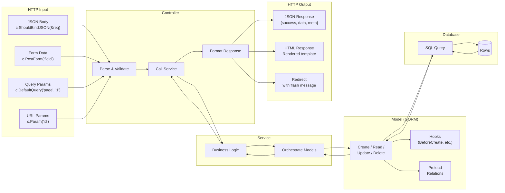
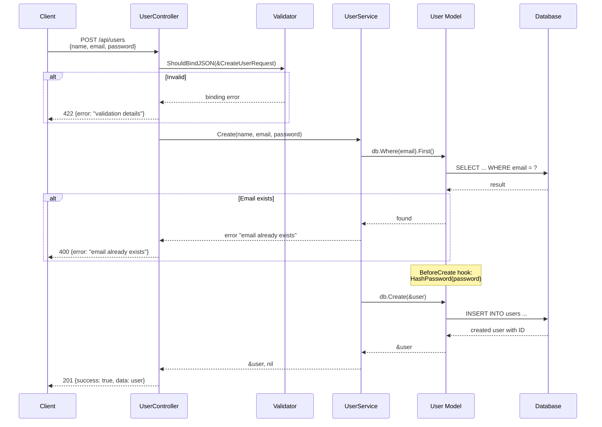
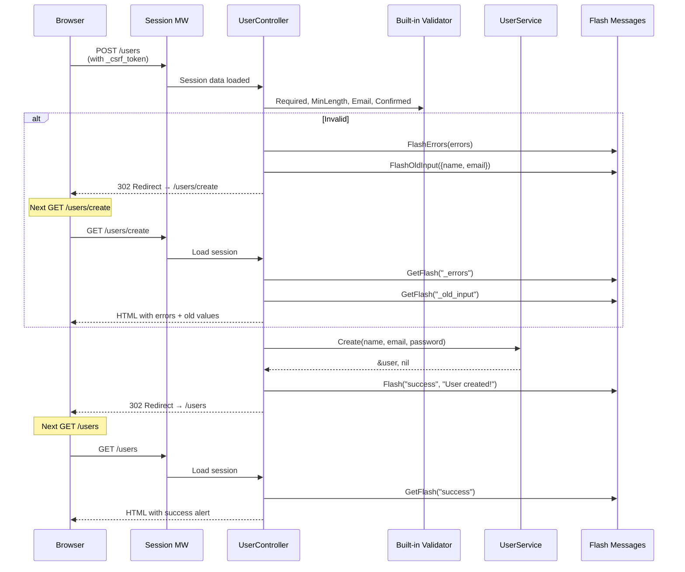
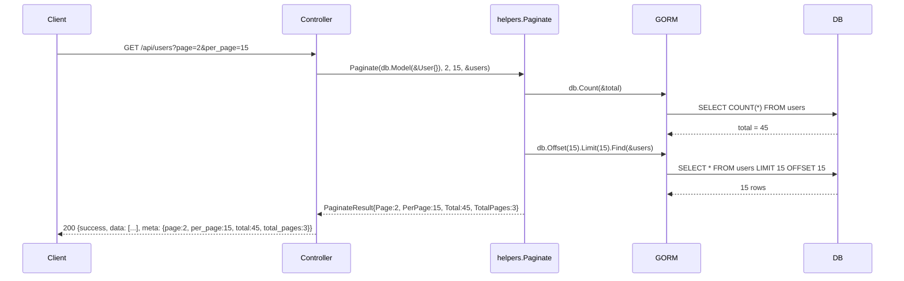
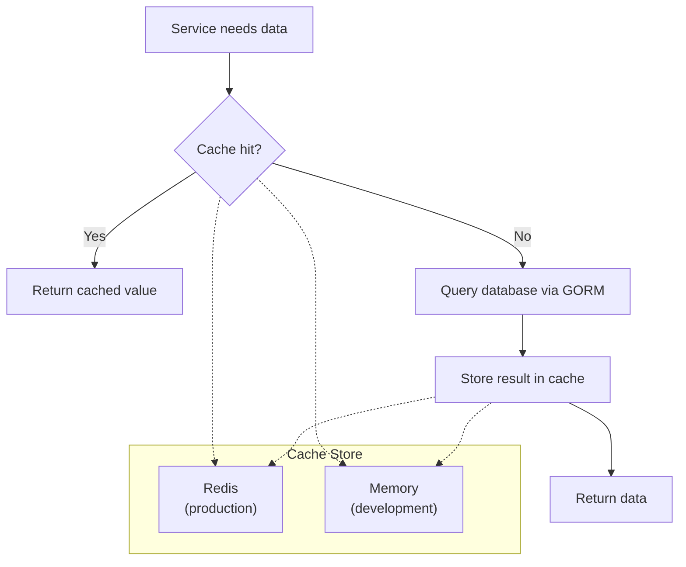
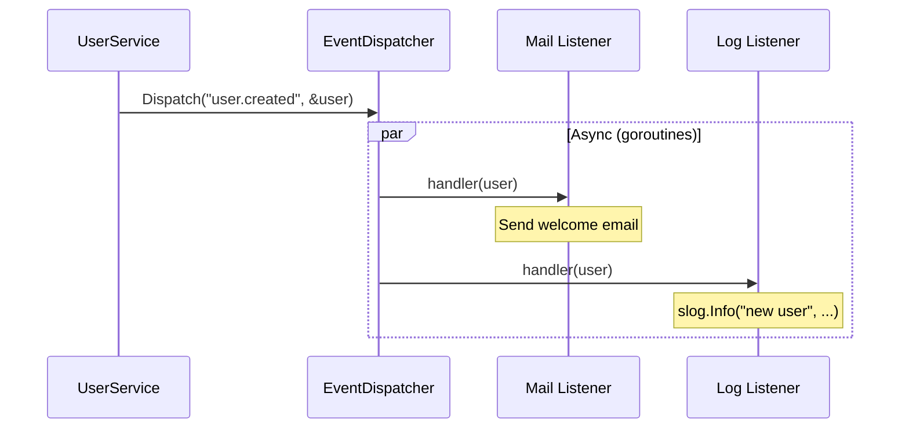

# Data Flow Diagram

## Abstract

This diagram traces data flow from the controller through the service
layer to the database and back, showing how data is transformed at
each stage for both API and SSR responses.

## Primary Data Flow

## API Create Flow (POST /api/users)

## SSR Form Flow (POST /users)

## Pagination Data Flow

## Caching Data Flow

## Event Dispatch Flow

## References

- [System Overview](system-overview.md)
- [Request Lifecycle](request-lifecycle.md)
- [Services Layer](../../infrastructure/services-layer.md)
- [Database](../../data/database.md)
- [Pagination](../../data/pagination.md)
- [Caching](../../infrastructure/caching.md)
- [Events](../../infrastructure/events.md)

## Revision History

| Version | Date | Author | Changes |
|---------|------|--------|---------|
| 0.1.0 | 2026-03-05 | RAiWorks | Initial draft |
