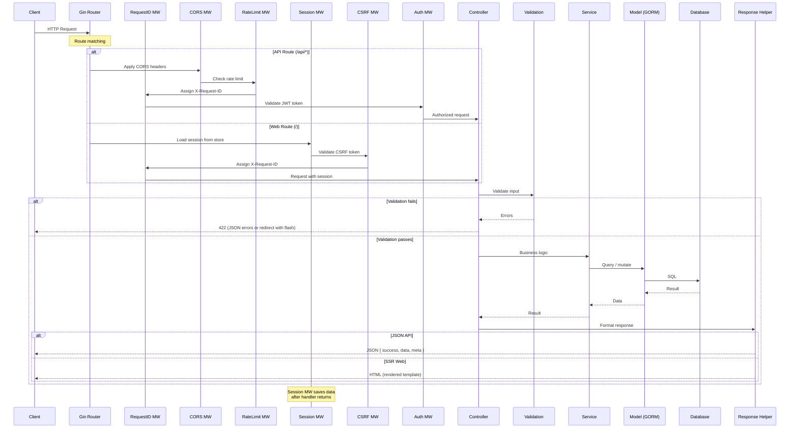
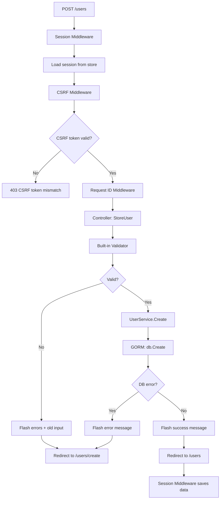
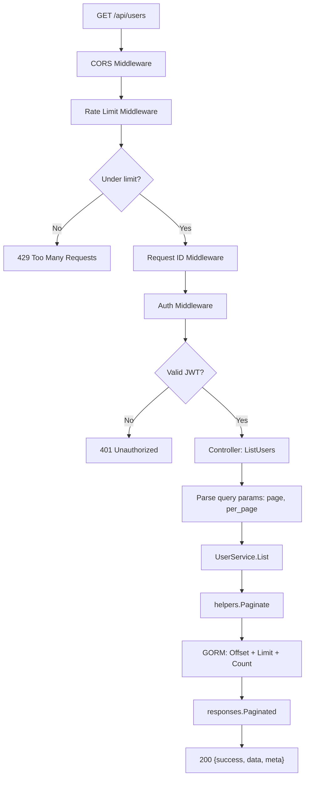

# Request Lifecycle Diagram

## Abstract

This diagram traces the complete journey of an HTTP request through the
framework — from initial receipt to final response — showing every
middleware, service, and component involved.

## Request Flow Diagram



## Web Route Flow (Detailed)

For a typical web form submission (`POST /users`):



## API Route Flow (Detailed)

For a typical API request (`GET /api/users`):



## Middleware Execution Order

Middleware executes in registration order. The framework defines two
default groups:

### Web Group

```text
1. SessionMiddleware  → Load/save session per request
2. CSRFMiddleware     → Generate/validate CSRF tokens
3. RequestIDMiddleware → Assign X-Request-ID header
```

### API Group

```text
1. CORSMiddleware      → Set CORS headers
2. RateLimitMiddleware  → Enforce rate limits
3. RequestIDMiddleware  → Assign X-Request-ID header
```

Additional middleware (e.g., `auth`, `admin`) is applied per route
or per route group.

## References

- [System Overview](system-overview.md)
- [Routing](../../http/routing.md)
- [Middleware](../../http/middleware.md)
- [Controllers](../../http/controllers.md)
- [Responses](../../http/responses.md)

## Revision History

| Version | Date | Author | Changes |
|---------|------|--------|---------|
| 0.1.0 | 2026-03-05 | RAiWorks | Initial draft |
