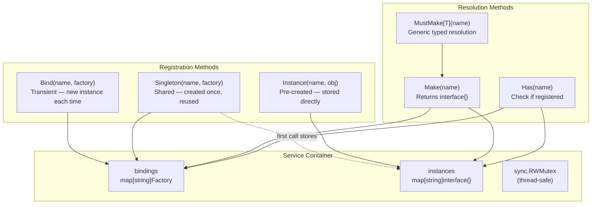
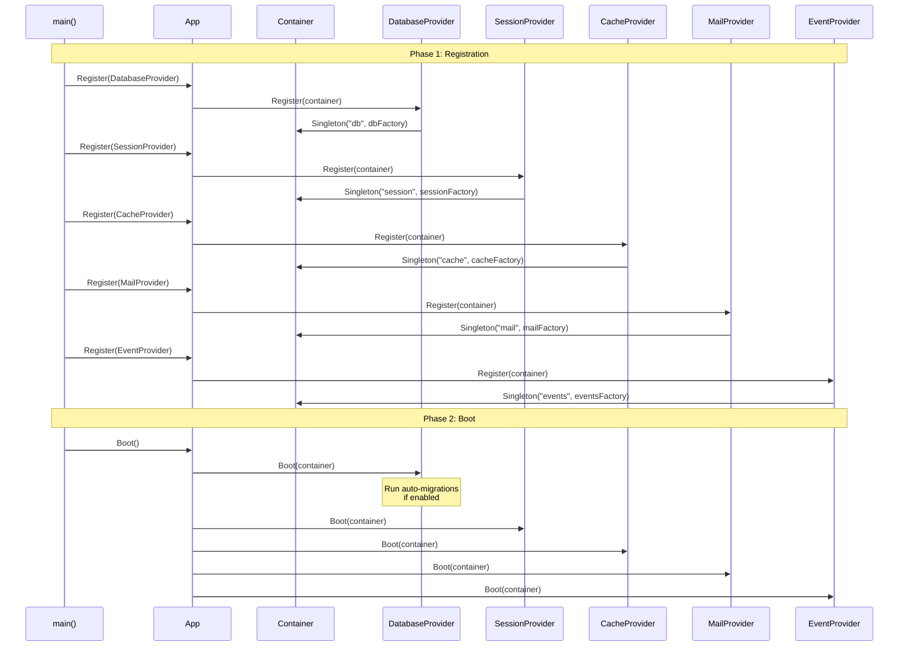
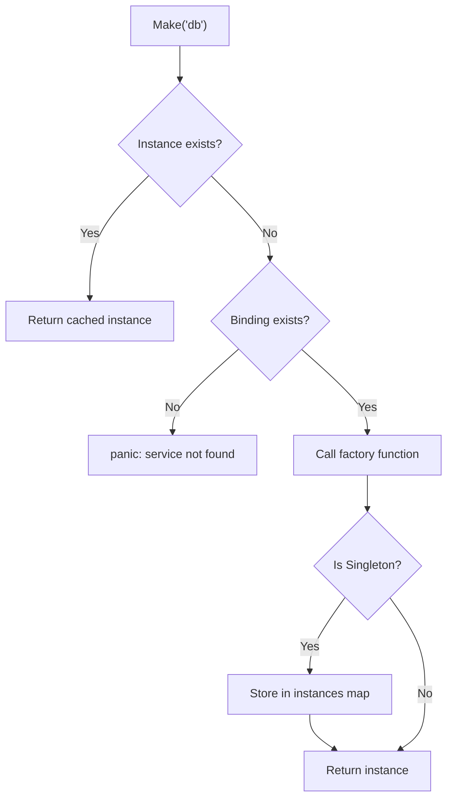
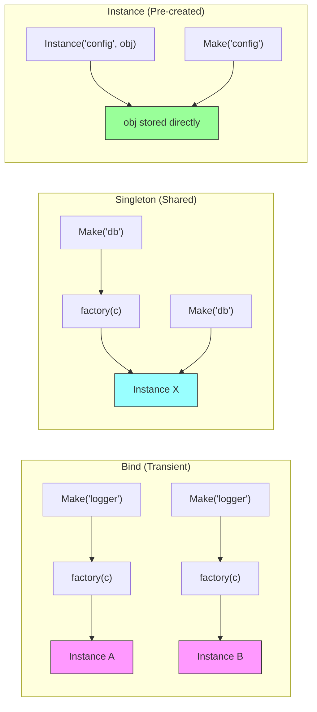
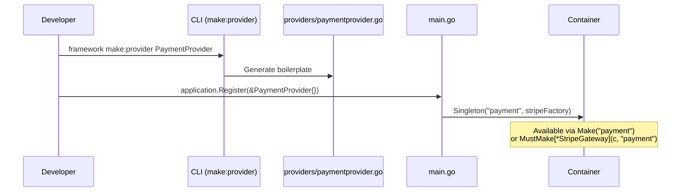

# Service Container Diagram

## Abstract

This diagram illustrates the service container's internal structure,
the provider registration/boot lifecycle, and how services are
resolved at runtime.

## Container Architecture

## Provider Lifecycle

## Resolution Flow

## Binding Types

## Built-in Service Bindings

| Service Name | Type | Provider | Returns |
|-------------|------|----------|---------|
| `"db"` | Singleton | `DatabaseProvider` | `*gorm.DB` |
| `"session"` | Singleton | `SessionProvider` | `*session.Manager` |
| `"cache"` | Singleton | `CacheProvider` | `cache.Store` (Redis or Memory) |
| `"mail"` | Singleton | `MailProvider` | `*mail.Mailer` |
| `"events"` | Singleton | `EventProvider` | `*events.Dispatcher` |

## Custom Provider Example

## References

- [Service Container](../../core/service-container.md)
- [Service Providers](../../core/service-providers.md)
- [Application Lifecycle](../application-lifecycle.md)
- [System Overview](system-overview.md)

## Revision History

| Version | Date | Author | Changes |
|---------|------|--------|---------|
| 0.1.0 | 2026-03-05 | RAiWorks | Initial draft |
