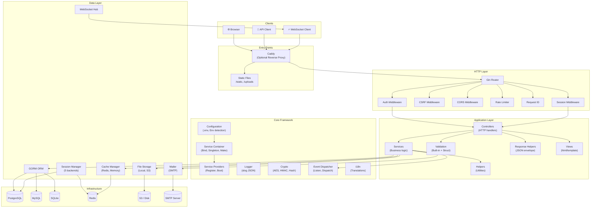

# System Overview Diagram

## Abstract

This diagram shows the high-level system architecture, illustrating
the major layers (HTTP, Application, Core, Data, Infrastructure) and
how they connect.

## Diagram

## Layer Summary

| Layer | Responsibility |
|-------|---------------|
| **Clients** | Browsers, mobile apps, API consumers, WebSocket clients |
| **Entry Points** | Caddy reverse proxy (optional), static file serving |
| **HTTP Layer** | Gin router, middleware pipeline (auth, CSRF, CORS, rate limit, request ID, session) |
| **Application Layer** | Controllers, services, helpers, validation, response formatting, views |
| **Core Framework** | Service container, providers, configuration, logging, crypto, events, i18n |
| **Data Layer** | GORM ORM, session manager, cache manager, file storage, mailer, WebSocket hub |
| **Infrastructure** | PostgreSQL, MySQL, SQLite, Redis, S3/disk, SMTP server |

## References

- [Architecture Overview](../overview.md)
- [Request Lifecycle](request-lifecycle.md)
- [Service Container](service-container.md)
- [Data Flow](data-flow.md)

## Revision History

| Version | Date | Author | Changes |
|---------|------|--------|---------|
| 0.1.0 | 2026-03-05 | RAiWorks | Initial draft |
