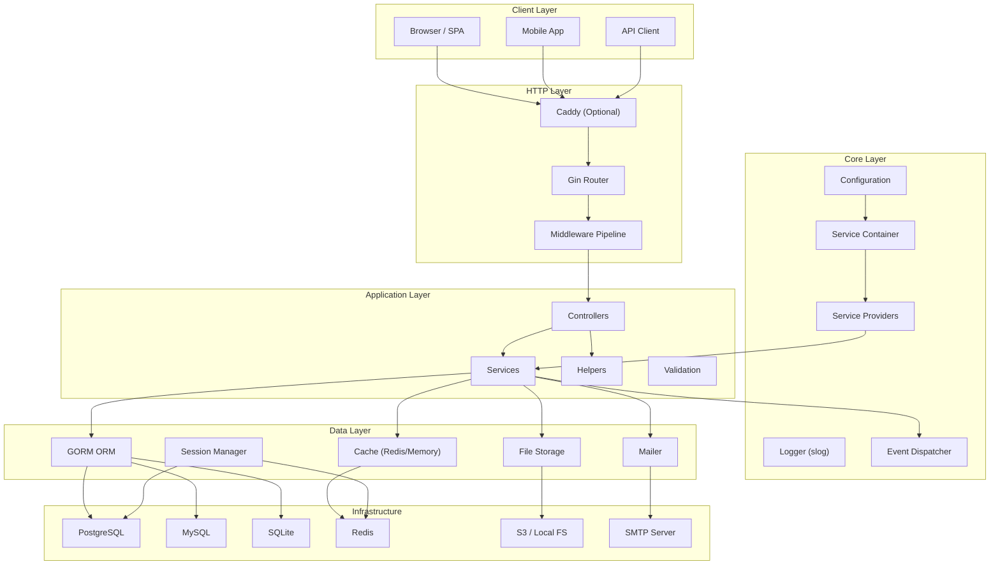

# Architecture Overview

## Abstract

This document provides a high-level overview of the Go web framework's
architecture, capabilities, and design philosophy. It serves as the
entry point for developers who want to understand the framework's
structure before diving into component-specific documentation.

## Table of Contents

1. [Terminology](#1-terminology)
2. [Mission Statement](#2-mission-statement)
3. [Supported Capabilities](#3-supported-capabilities)
4. [Architectural Pattern](#4-architectural-pattern)
5. [Technology Stack](#5-technology-stack)
6. [System Architecture](#6-system-architecture)
7. [Layer Responsibilities](#7-layer-responsibilities)
8. [Security Considerations](#8-security-considerations)
9. [References](#9-references)

## 1. Terminology

The key words "MUST", "MUST NOT", "REQUIRED", "SHALL", "SHALL NOT",
"SHOULD", "SHOULD NOT", "RECOMMENDED", "MAY", and "OPTIONAL" in this
document are to be interpreted as described in [RFC 2119].

- **MVC** — Model-View-Controller architectural pattern
- **DI** — Dependency Injection
- **IoC** — Inversion of Control
- **SSR** — Server-Side Rendering
- **ORM** — Object-Relational Mapping

See the [Glossary](../appendix/glossary.md) for the complete list of terms.

## 2. Mission Statement

The framework combines **Laravel-style developer experience with Go
performance**. It provides a full-featured, opinionated web framework
that supports web applications, REST APIs, WebSockets, and CLI tools
— all built on proven Go libraries and idiomatic patterns.

## 3. Supported Capabilities

The framework **MUST** support the following capabilities:

### Core Application

- Web applications (MVC + Services + Helpers pattern)
- REST APIs with JSON responses
- WebSockets (real-time communication)
- CLI tools (scaffolding, migrations, seeds)

### Data & Storage

- ORM / query builder with transactions (PostgreSQL, MySQL, SQLite)
- File upload & storage (local filesystem, Amazon S3)
- Caching (Redis, memory)
- Database seeding and migrations

### HTTP & Middleware

- Middleware pipeline (auth, CSRF, CORS, rate limiting, request ID)
- Input validation (built-in engine + struct-based)
- Pagination helpers
- Response helpers with standardized API envelope
- Static file serving

### Security

- Authentication (JWT stateless + session-based)
- Session management (database, Redis, file, memory, cookie backends)
- CSRF protection
- CORS handling
- Rate limiting
- Built-in cryptographic utilities (AES-256-GCM, HMAC, hashing)

### Infrastructure

- Service container & service providers (extensibility)
- Configuration management (.env / YAML)
- Environment detection (development, production, testing)
- Mail / email sending
- Health check endpoints
- Graceful shutdown
- Structured logging (JSON)

### Optional Features

The following features **MAY** be enabled based on deployment needs:

- Caddy web server (as embedded library or external reverse proxy)
- Docker containerized deployment
- Events / hooks system
- Localization / i18n

## 4. Architectural Pattern

The framework uses the **MVC + Services + Helpers** pattern:

```text
┌──────────────────────────────────────────────────────┐
│                    HTTP Request                       │
├──────────────────────────────────────────────────────┤
│               Middleware Pipeline                     │
│   (auth, CSRF, CORS, rate-limit, request-id, session)│
├──────────────────────────────────────────────────────┤
│                   Router (Gin)                        │
│          (resource routes, named routes,              │
│           route model binding)                        │
├──────────────────────────────────────────────────────┤
│                  Controllers                          │
│          (HTTP concerns only — parse request,         │
│           call service, return response)              │
├──────────────────────────────────────────────────────┤
│                   Services                            │
│          (business logic, domain rules,               │
│           orchestration)                              │
├──────────────────────────────────────────────────────┤
│               Models (GORM)                           │
│          (data schema, relationships,                 │
│           hooks, database queries)                    │
├──────────────────────────────────────────────────────┤
│                  Database                             │
│          (PostgreSQL, MySQL, SQLite)                  │
└──────────────────────────────────────────────────────┘
```

- **Controllers** handle HTTP concerns: parse request data, delegate to
  services, and return responses (JSON or HTML).
- **Services** contain business logic and sit between controllers and
  models. They **MUST NOT** access HTTP request/response objects directly.
- **Models** define data schema and relationships using GORM.
- **Helpers** provide stateless utility functions (hashing, string
  manipulation, formatting) used across all layers.

## 5. Technology Stack

| Component | Library | Import Path |
|-----------|---------|-------------|
| HTTP Router | Gin | `github.com/gin-gonic/gin` |
| ORM | GORM | `gorm.io/gorm` |
| CLI | Cobra | `github.com/spf13/cobra` |
| Configuration | Viper / godotenv | `github.com/spf13/viper` / `github.com/joho/godotenv` |
| JWT | golang-jwt | `github.com/golang-jwt/jwt/v5` |
| WebSocket | coder/websocket | `github.com/coder/websocket` |
| Redis | go-redis | `github.com/redis/go-redis/v9` |
| CORS | gin-contrib/cors | `github.com/gin-contrib/cors` |
| Rate Limiting | ulule/limiter | `github.com/ulule/limiter/v3` |
| Email | go-mail | `github.com/wneessen/go-mail` |
| S3 Storage | aws-sdk-go-v2 | `github.com/aws/aws-sdk-go-v2` |
| Web Server | Caddy | `github.com/caddyserver/caddy/v2` |
| Logging | slog | `log/slog` (standard library) |
| Struct Validation | validator | `github.com/go-playground/validator/v10` |
| Password Hashing | bcrypt | `golang.org/x/crypto/bcrypt` |

## 6. System Architecture



## 7. Layer Responsibilities

### HTTP Layer

Handles all inbound HTTP traffic. The Gin router dispatches requests
through the middleware pipeline to the appropriate controller. This
layer **MUST** handle:

- Route registration (resource routes, named routes, model binding)
- Middleware execution (authentication, CSRF, CORS, rate limiting)
- Request parsing and response formatting
- WebSocket upgrade and connection management
- Static file serving

See: [Routing](../http/routing.md), [Middleware](../http/middleware.md),
[Controllers](../http/controllers.md)

### Application Layer

Contains user-facing business logic. Controllers delegate to services,
which orchestrate domain operations. This layer **MUST NOT** depend on
HTTP-specific constructs (except controllers, which bridge HTTP and
business logic).

See: [Controllers](../http/controllers.md),
[Services Layer](../infrastructure/services-layer.md),
[Helpers Reference](../reference/helpers-reference.md)

### Core Layer

The framework's internal engine. The service container provides
dependency injection; service providers register and boot framework
components. Configuration is loaded from `.env` files.

See: [Service Container](../core/service-container.md),
[Service Providers](../core/service-providers.md),
[Configuration](../core/configuration.md)

### Data Layer

Manages persistence, caching, sessions, file storage, and email.
All subsystems use a **driver-based architecture** with a common
interface so backends can be swapped via configuration.

See: [Database](../data/database.md), [Models](../data/models.md),
[Caching](../infrastructure/caching.md), [Sessions](../security/sessions.md)

## 8. Security Considerations

Security is a cross-cutting concern addressed throughout the framework:

- **Authentication** — JWT for APIs, session-based for web apps.
  See [Authentication](../security/authentication.md).
- **CSRF** — Per-session tokens validated on state-changing requests.
  See [CSRF](../security/csrf.md).
- **CORS** — Configurable allowed origins, methods, and headers.
  See [CORS](../security/cors.md).
- **Rate Limiting** — Configurable per-route and global limits.
  See [Rate Limiting](../security/rate-limiting.md).
- **Encryption** — AES-256-GCM for sensitive data, bcrypt for passwords.
  See [Crypto](../security/crypto.md).
- **Input Validation** — Built-in validator + struct-based validation
  prevent injection and malformed input.
  See [Requests & Validation](../http/requests-validation.md).

## 9. References

- [Design Principles](design-principles.md)
- [Project Structure](project-structure.md)
- [Application Lifecycle](application-lifecycle.md)
- [System Overview Diagram](diagrams/system-overview.md)
- [Request Lifecycle Diagram](diagrams/request-lifecycle.md)
- [Service Container Diagram](diagrams/service-container.md)
- [Data Flow Diagram](diagrams/data-flow.md)

## Revision History

| Version | Date | Author | Changes |
|---------|------|--------|---------|
| 0.1.0 | 2026-03-05 | RAiWorks | Initial draft |
