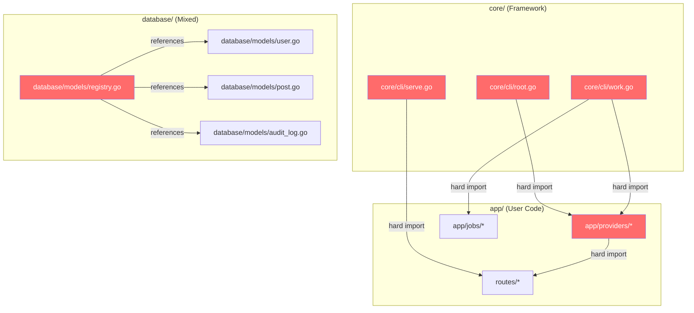

# RapidGo — Importable Library Architecture: Discussion & Split Plan

> **Project**: RapidGo Framework  
> **Author**: RAiWorks  
> **Date**: 2026-03-07  
> **Status**: Proposal — for discussion  

---

## 1. Executive Summary

RapidGo is currently a **monolithic starter** (clone-and-build-inside). This document proposes transforming it into an **importable Go library** with a companion **CLI scaffolder** and **starter template** — retaining the Laravel-style DX while unlocking clean versioning, multi-project reuse, and Go-ecosystem-native adoption.

The transition requires **breaking 5 hard coupling points** in the current codebase while preserving all existing functionality. No features are lost — they are redistributed between two repositories.

---

## 2. Why Change? — The Problem with Clone-and-Build

### 2.1 Framework Distribution Models Compared

| Aspect | 🏗️ Monolithic Starter (Current) | 📦 Importable Library (Proposed) |
|--------|----------------------------------|----------------------------------|
| **Onboarding** | `git clone` → start coding | `rapidgo new myapp` → start coding |
| **Upgrades** | 😬 Manual git merge conflicts | ✅ `go get -u github.com/RAiWorks/RapidGo@latest` |
| **Multi-project** | Copy entire repo per project | Import same module everywhere |
| **Customization** | Edit framework internals freely | Extend via interfaces, wrap behaviors |
| **Go ecosystem fit** | ❌ Unusual — Go devs expect `go get` | ✅ Idiomatic — how Gin, Echo, Fiber work |
| **Framework testing** | Hard — app code mixed in | Easy — framework has its own isolated tests |
| **Community adoption** | Lower — heavy to start | Higher — low-commitment `go get` to try |
| **Version pinning** | ❌ No semantic versioning | ✅ Go modules handle everything |

### 2.2 The Upgrade Problem (Critical)

Today, when a bug is fixed in `core/router/`, **every user must manually merge changes** into their modified copy:

```bash
# Current painful upgrade process
git remote add upstream https://github.com/RAiWorks/RapidGo.git
git fetch upstream
git merge upstream/main  # 💥 Merge conflicts with user's app code
```

With an importable library:

```bash
# Clean upgrade
go get -u github.com/RAiWorks/RapidGo@v1.2.3
# Done. No merge conflicts. No manual patching.
```

### 2.3 Successful Frameworks That Use This Model

| Framework | Language | Library Repo | Scaffolder |
|-----------|----------|-------------|------------|
| **Spring Boot** | Java | `spring-boot-starter-*` | `spring initializr` |
| **AdonisJS** | Node | `@adonisjs/core` | `npm init adonis-ts-app` |
| **Buffalo** | Go | `github.com/gobuffalo/buffalo` | `buffalo new` |
| **Fiber** | Go | `github.com/gofiber/fiber` | Example repos |
| **Laravel** | PHP | `laravel/framework` | `laravel new` / `composer create-project` |

> [!NOTE]
> Even Laravel — RapidGo's primary inspiration — ships as an importable library (`laravel/framework`) with a separate starter project (`laravel/laravel`).

---

## 3. Cross-Check Audit Findings (Summary)

> Full details: [🔍 RapidGo Framework — Cross-Check Audit Report](file:///C:/Users/rajesh/.gemini/antigravity/brain/aa6241b7-2401-42ee-b393-95497014d297/rapidgo_audit_report.md)

The audit identified issues that the importable split would naturally resolve:

### 3.1 Scope Creep → Resolved by Split

| Finding | Impact on Split |
|---------|----------------|
| 7 Phase 6 features (#42–#45, #50–#52) implemented but marked 🔮 Future | These are all in `core/` — they become part of the library naturally. Update roadmap. |
| 2 features (#55, #56) beyond 54-item scope | Same — already in `core/`. Just update docs. |
| Roadmap says 0/13 Phase 6 done, actually 7+ | Fix counts during split. |

### 3.2 Gaps → Resolved by Split

| Finding | How Split Fixes It |
|---------|-------------------|
| Empty `tests/` directory | Library gets isolated tests. Starter gets integration test examples. |
| `database/querybuilder/` documented but missing | Clarify in library docs or implement in `core/`. |
| WebSocket routes are placeholder | Placeholder stays in starter as a demo scaffold. Library's `core/websocket/` is already complete. |
| No session-based auth controller | Auth middleware stays in library. Session login/logout controllers go in starter as app-specific examples. |
| Viper in tech stack but not used | Remove from docs, or implement in `core/config/` during the split. |

### 3.3 Security → Resolved by Split

| Finding | How Split Fixes It |
|---------|-------------------|
| `.env` committed with secrets | Library has no `.env`. Starter ships `.env.example` (gitignored `.env`). |
| No JWT secret strength validation | Add to `core/auth/jwt.go` in the library. |

### 3.4 Documentation → Resolved by Split

| Finding | Resolution |
|---------|-----------|
| Tech stack table missing 3 deps | Update in library README |
| Project structure outdated | Each repo gets its own accurate structure doc |
| Feature docs for #42-#52, #55-#56 | Move to library docs since those features are in `core/` |

---

## 4. Coupling Analysis — What Prevents Importability Today

### 4.1 The 5 Hard Coupling Points

The `core/` packages are **almost** importable already. Only 5 files create circular/hard dependencies between framework code and app-specific code:



### 4.2 Coupling Details

| File | Hard Import | Why It's a Problem |
|------|-------------|-------------------|
| [core/cli/root.go](file:///c:/tmp/RapidGo_Cross_Check/core/cli/root.go) | `app/providers` | `NewApp()` function directly instantiates `providers.ConfigProvider{}`, etc. |
| [core/cli/serve.go](file:///c:/tmp/RapidGo_Cross_Check/core/cli/serve.go) | `routes` | `applyRoutesForMode()` calls `routes.RegisterWeb()`, `routes.RegisterAPI()`, `routes.RegisterWS()` |
| [core/cli/work.go](file:///c:/tmp/RapidGo_Cross_Check/core/cli/work.go) | `app/jobs`, `app/providers` | Worker command directly calls `jobs.RegisterJobs()` and uses app providers |
| [app/providers/router_provider.go](file:///c:/tmp/RapidGo_Cross_Check/app/providers/router_provider.go) | `routes` | Boot method calls `routes.RegisterWeb(r)`, etc. |
| [database/models/registry.go](file:///c:/tmp/RapidGo_Cross_Check/database/models/registry.go) | App models | `All()` returns `&User{}`, `&Post{}`, `&AuditLog{}` — app-specific models |

### 4.3 What's Already Clean (No Changes Needed)

These `core/` packages have **zero app-specific imports** and are already importable:

| Package | Status |
|---------|--------|
| `core/app/` | ✅ Clean — depends only on `core/container` |
| `core/container/` | ✅ Clean — zero external deps |
| `core/config/` | ✅ Clean — only `godotenv` |
| `core/logger/` | ✅ Clean — only `log/slog` |
| `core/errors/` | ✅ Clean |
| `core/router/` | ✅ Clean — only `gin` |
| `core/middleware/` | ✅ Clean — only `gin`, `core/auth`, `core/session` |
| `core/auth/` | ✅ Clean — only `golang-jwt` |
| `core/crypto/` | ✅ Clean — only `golang.org/x/crypto` |
| `core/session/` | ✅ Clean |
| `core/cache/` | ✅ Clean |
| `core/mail/` | ✅ Clean |
| `core/events/` | ✅ Clean |
| `core/i18n/` | ✅ Clean |
| `core/health/` | ✅ Clean |
| `core/server/` | ✅ Clean |
| `core/websocket/` | ✅ Clean |
| `core/validation/` | ✅ Clean |
| `core/storage/` | ✅ Clean |
| `core/queue/` | ✅ Clean |
| `core/scheduler/` | ✅ Clean |
| `core/graphql/` | ✅ Clean |
| `core/audit/` | ✅ Clean |
| `core/totp/` | ✅ Clean |
| `core/plugin/` | ✅ Clean |
| `core/service/` | ✅ Clean |
| `database/connection.go` | ✅ Clean — only `core/config` + GORM drivers |
| `database/transaction.go` | ✅ Clean |
| `database/migrations/migrator.go` | ✅ Clean |

> [!TIP]
> **~90% of the framework code is already importable.** The split only requires refactoring the 5 coupling points listed above.

---

## 5. The Split Plan

### 5.1 Two-Repository Architecture

```
github.com/RAiWorks/RapidGo          ← Importable framework library (go get)
github.com/RAiWorks/RapidGo-starter  ← Scaffold project (clone → build inside)
```

### 5.2 What Goes Where

#### 📦 `RapidGo` (Library) — Everything Reusable

```
github.com/RAiWorks/RapidGo/
├── core/                       # ALL core packages (unchanged)
│   ├── app/                    # App container & lifecycle
│   ├── container/              # Service container (DI)
│   ├── config/                 # Config loader
│   ├── logger/                 # Structured logging
│   ├── errors/                 # Error types
│   ├── router/                 # Router engine
│   ├── middleware/             # All middleware
│   ├── auth/                   # JWT auth
│   ├── crypto/                 # Hashing, encryption
│   ├── session/                # Session management
│   ├── cache/                  # Cache backends
│   ├── mail/                   # Email sender
│   ├── events/                 # Event dispatcher
│   ├── i18n/                   # Localization
│   ├── health/                 # Health checks
│   ├── server/                 # HTTP server
│   ├── websocket/              # WebSocket hub
│   ├── validation/             # Input validation
│   ├── storage/                # File storage (local + S3)
│   ├── queue/                  # Queue drivers & worker
│   ├── scheduler/              # Task scheduler
│   ├── graphql/                # GraphQL handler
│   ├── audit/                  # Audit logging
│   ├── totp/                   # TOTP 2FA
│   ├── plugin/                 # Plugin system
│   ├── service/                # Service mode
│   └── cli/                    # CLI commands (REFACTORED — see §5.3)
├── database/
│   ├── connection.go           # DB connection factory
│   ├── transaction.go          # Transaction helpers
│   ├── transaction_example.go  # Transaction examples
│   └── migrations/
│       └── migrator.go         # Migration engine (no app-specific migrations)
├── testing/
│   └── testutil/               # Test utilities for user apps
├── go.mod                      # github.com/RAiWorks/RapidGo
├── go.sum
├── LICENSE
└── README.md
```

#### 🏗️ `RapidGo-starter` (Scaffold) — App-Specific Code

```
github.com/RAiWorks/RapidGo-starter/
├── cmd/
│   └── main.go                 # Entry point (calls rapidgo.Execute)
├── app/
│   ├── helpers/                # App-specific helpers
│   │   ├── data.go
│   │   ├── env.go
│   │   ├── number.go
│   │   ├── pagination.go
│   │   ├── password.go
│   │   ├── random.go
│   │   ├── string.go
│   │   └── time.go
│   ├── providers/              # App-specific service providers
│   │   ├── config_provider.go
│   │   ├── database_provider.go
│   │   ├── logger_provider.go
│   │   ├── middleware_provider.go
│   │   ├── queue_provider.go
│   │   ├── redis_provider.go
│   │   ├── router_provider.go
│   │   └── session_provider.go
│   ├── services/               # Business logic
│   │   └── user_service.go
│   ├── jobs/                   # Background jobs
│   │   └── example_job.go
│   ├── schedule/               # Scheduled tasks
│   │   └── schedule.go
│   └── plugins.go              # Plugin registration
├── database/
│   ├── models/                 # App-specific models
│   │   ├── user.go
│   │   ├── post.go
│   │   ├── audit_log.go
│   │   ├── registry.go
│   │   └── scopes.go
│   ├── migrations/             # App-specific migrations
│   │   ├── 20260307000001_create_jobs_tables.go
│   │   ├── 20260308000001_add_soft_deletes.go
│   │   ├── 20260308000002_add_totp_fields.go
│   │   └── 20260308000003_create_audit_logs_table.go
│   └── seeders/                # Seed data
│       ├── seeder.go
│       └── user_seeder.go
├── http/
│   ├── controllers/            # Request handlers
│   │   ├── home_controller.go
│   │   └── post_controller.go
│   └── responses/              # Response formatting
│       └── response.go
├── routes/                     # Route definitions
│   ├── web.go
│   ├── api.go
│   └── ws.go
├── resources/
│   ├── views/                  # HTML templates
│   │   └── home.html
│   ├── lang/                   # Translation files
│   └── static/                 # CSS, JS, images
├── storage/                    # Runtime directories
│   ├── uploads/
│   ├── cache/
│   ├── sessions/
│   └── logs/
├── plugins/                    # Plugin implementations
│   └── example/
│       └── example.go
├── tests/                      # Integration & e2e tests
├── .env.example                # ← Renamed from .env
├── .gitignore                  # Ignores .env, storage/*, etc.
├── Dockerfile
├── docker-compose.yml
├── Caddyfile
├── Makefile
├── go.mod                      # Imports github.com/RAiWorks/RapidGo
└── README.md
```

### 5.3 How to Break the 5 Coupling Points

#### Coupling #1 — `core/cli/root.go` → `app/providers`

**Problem**: `NewApp()` hard-codes provider registration.

**Solution**: Replace with a **callback/hook pattern** — the library provides a `Bootstrap` function, the app passes its providers.

```diff
- // core/cli/root.go (BEFORE)
- import "github.com/RAiWorks/RapidGo/app/providers"
-
- func NewApp(mode service.Mode) *app.App {
-     application := app.New()
-     application.Register(&providers.ConfigProvider{})
-     application.Register(&providers.LoggerProvider{})
-     // ... hard-coded providers
-     application.Boot()
-     return application
- }

+ // core/cli/root.go (AFTER)
+ // BootstrapFunc is called to register providers on the application.
+ type BootstrapFunc func(application *app.App, mode service.Mode)
+
+ var bootstrapFn BootstrapFunc
+
+ // SetBootstrap registers the application bootstrap function.
+ // Called once from the starter's main.go.
+ func SetBootstrap(fn BootstrapFunc) {
+     bootstrapFn = fn
+ }
+
+ func NewApp(mode service.Mode) *app.App {
+     application := app.New()
+     if bootstrapFn != nil {
+         bootstrapFn(application, mode)
+     }
+     application.Boot()
+     return application
+ }
```

**Starter's `main.go`** then becomes:

```go
package main

import (
    "github.com/RAiWorks/RapidGo/core/cli"
    "myapp/app/providers"
    "myapp/routes"
)

func main() {
    cli.SetBootstrap(providers.Bootstrap) // registers providers
    cli.SetRoutes(routes.Register)        // registers routes
    cli.Execute()
}
```

---

#### Coupling #2 — `core/cli/serve.go` → `routes`

**Problem**: `applyRoutesForMode()` directly calls `routes.RegisterWeb()`, etc.

**Solution**: Route registration via callback (same pattern).

```diff
- // core/cli/serve.go (BEFORE)
- import "github.com/RAiWorks/RapidGo/routes"
-
- func applyRoutesForMode(r *router.Router, ...) {
-     routes.RegisterWeb(r)
-     routes.RegisterAPI(r)
-     routes.RegisterWS(r)
- }

+ // core/cli/serve.go (AFTER)
+ // RouteRegistrar is called to register routes per service mode.
+ type RouteRegistrar func(r *router.Router, c *container.Container, mode service.Mode)
+
+ var routeRegistrar RouteRegistrar
+
+ func SetRoutes(fn RouteRegistrar) {
+     routeRegistrar = fn
+ }
+
+ func applyRoutesForMode(r *router.Router, c *container.Container, m service.Mode) {
+     if routeRegistrar != nil {
+         routeRegistrar(r, c, m)
+     }
+     // Health check stays in framework
+     if c.Has("db") {
+         health.Routes(r, func() *gorm.DB {
+             return container.MustMake[*gorm.DB](c, "db")
+         })
+     }
+ }
```

---

#### Coupling #3 — `core/cli/work.go` → `app/jobs` + `app/providers`

**Problem**: Worker command hard-imports `app/jobs` and `app/providers`.

**Solution**: Same callback pattern — job registration via hook.

```diff
- // core/cli/work.go (BEFORE)
- import "github.com/RAiWorks/RapidGo/app/jobs"
- jobs.RegisterJobs()

+ // core/cli/work.go (AFTER)
+ // JobRegistrar registers application job handlers.
+ type JobRegistrar func()
+
+ var jobRegistrar JobRegistrar
+
+ func SetJobRegistrar(fn JobRegistrar) {
+     jobRegistrar = fn
+ }
+
+ // In workCmd.RunE:
+ if jobRegistrar != nil {
+     jobRegistrar()
+ }
```

---

#### Coupling #4 — `app/providers/router_provider.go` → `routes`

**Problem**: Provider directly calls `routes.RegisterWeb(r)`.

**Solution**: This file **moves entirely to the starter** since it's app-specific. The library provides **a default `RouterProvider` base** that the starter can extend:

```go
// core/providers/router.go (LIBRARY)
// BaseRouterProvider handles template loading and static serving.
type BaseRouterProvider struct {
    Mode service.Mode
}

func (p *BaseRouterProvider) Register(c *container.Container) {
    c.Instance("router", router.New())
}

func (p *BaseRouterProvider) Boot(c *container.Container) {
    r := container.MustMake[*router.Router](c, "router")
    // Template and static setup based on mode...
}
```

```go
// app/providers/router_provider.go (STARTER — extends base)
type RouterProvider struct {
    providers.BaseRouterProvider // embed framework's base
}

func (p *RouterProvider) Boot(c *container.Container) {
    p.BaseRouterProvider.Boot(c)  // framework setup
    // App-specific routes:
    routes.RegisterWeb(r)
    routes.RegisterAPI(r)
}
```

---

#### Coupling #5 — `database/models/registry.go` → App Models

**Problem**: `All()` returns `&User{}`, `&Post{}`, `&AuditLog{}`.

**Solution**: Move `registry.go` to the starter. The library provides `BaseModel` only.

```go
// Library: database/models/base.go (stays)
type BaseModel struct { ... }

// Starter: database/models/registry.go (moves here)
func All() []interface{} {
    return []interface{}{&User{}, &Post{}, &AuditLog{}}
}
```

---

### 5.4 File-by-File Split Table

| Current Location | Destination | Reason |
|-----------------|-------------|--------|
| **`core/`** (all packages) | 📦 Library | Framework internals — zero app-specific code |
| **`database/connection.go`** | 📦 Library | Generic DB connection factory |
| **`database/transaction.go`** | 📦 Library | Generic transaction helpers |
| **`database/migrations/migrator.go`** | 📦 Library | Migration engine (generic) |
| **`database/models/base.go`** | 📦 Library | BaseModel with common fields |
| **`testing/testutil/`** | 📦 Library | Test utilities for users |
| `database/models/user.go` | 🏗️ Starter | App-specific model |
| `database/models/post.go` | 🏗️ Starter | App-specific model |
| `database/models/audit_log.go` | 🏗️ Starter | App-specific model |
| `database/models/registry.go` | 🏗️ Starter | App-specific model list |
| `database/models/scopes.go` | 🏗️ Starter | App-specific query scopes |
| `database/migrations/2026*` | 🏗️ Starter | App-specific migrations |
| `database/seeders/` | 🏗️ Starter | App-specific seed data |
| `app/` (all) | 🏗️ Starter | App-specific code |
| `http/` (all) | 🏗️ Starter | App-specific controllers and responses |
| `routes/` (all) | 🏗️ Starter | App-specific route definitions |
| `resources/` (all) | 🏗️ Starter | App-specific views, lang, static |
| `storage/` (all) | 🏗️ Starter | Runtime directories |
| `plugins/` (all) | 🏗️ Starter | App-specific plugins |
| `cmd/main.go` | 🏗️ Starter | Entry point |
| `.env` | 🏗️ Starter (as `.env.example`) | App-specific config |
| `Dockerfile` | 🏗️ Starter | App-specific deployment |
| `docker-compose.yml` | 🏗️ Starter | App-specific deployment |
| `Caddyfile` | 🏗️ Starter | App-specific web server config |
| `Makefile` | 🏗️ Starter | App-specific build commands |
| `docs/` | Split | Framework docs → Library / Feature docs → both |

### 5.5 Starter `go.mod` Example

```go
module myapp

go 1.25.0

require (
    github.com/RAiWorks/RapidGo v1.0.0
)
```

All transitive dependencies (Gin, GORM, Cobra, etc.) are pulled automatically via the framework's `go.mod`.

---

## 6. CLI Scaffolder — `rapidgo new`

### 6.1 The Command

```bash
# Create a new RapidGo project
go run github.com/RAiWorks/RapidGo/cmd/rapidgo@latest new myapp
```

This would:
1. Create `myapp/` directory
2. Clone/copy the starter template
3. Replace module name `github.com/RAiWorks/RapidGo-starter` → `myapp`
4. Run `go mod tidy`
5. Print getting-started instructions

### 6.2 How the `new` Command Works

The `new` command lives in the **library** but references the starter template:

```go
// core/cli/new.go
var newCmd = &cobra.Command{
    Use:   "new [project-name]",
    Short: "Create a new RapidGo project",
    RunE: func(cmd *cobra.Command, args []string) error {
        // 1. Download starter template from GitHub releases or embed
        // 2. Replace module name
        // 3. go mod tidy
        // 4. Print success message
    },
}
```

### 6.3 Existing CLI Commands Stay

All `make:*` commands stay in the library — they generate files using Go templates:

| Command | Stays in Library? | Why |
|---------|------------------|-----|
| `make:controller` | ✅ Yes | Generates Go template code |
| `make:model` | ✅ Yes | Generates Go template code |
| `make:service` | ✅ Yes | Generates Go template code |
| `make:provider` | ✅ Yes | Generates Go template code |
| `make:migration` | ✅ Yes | Generates migration scaffold |
| `serve` | ✅ Yes (refactored) | Routes via callback |
| `migrate` / `migrate:rollback` / `migrate:status` | ✅ Yes | Works with migrator engine |
| `db:seed` | ✅ Yes (refactored) | Seed function via callback |
| `work` | ✅ Yes (refactored) | Jobs via callback |
| `schedule:run` | ✅ Yes (refactored) | Tasks via callback |
| `new` | ✅ Yes (NEW) | Scaffolds a new project |

---

## 7. The User Experience After the Split

### 7.1 New Project

```bash
# Install and create new project
go run github.com/RAiWorks/RapidGo/cmd/rapidgo@latest new myapp
cd myapp

# Run
make run        # or: go run cmd/main.go serve

# Generate code
go run cmd/main.go make:controller User
go run cmd/main.go make:model Product
go run cmd/main.go migrate
```

### 7.2 Upgrade Framework

```bash
go get -u github.com/RAiWorks/RapidGo@latest
go mod tidy
# Done — no merge conflicts
```

### 7.3 Starter's `main.go`

```go
package main

import (
    "github.com/RAiWorks/RapidGo/core/app"
    "github.com/RAiWorks/RapidGo/core/cli"
    "github.com/RAiWorks/RapidGo/core/service"

    "myapp/app/jobs"
    "myapp/app/providers"
    "myapp/app/schedule"
    "myapp/routes"
)

func main() {
    // Wire app-specific code into the framework
    cli.SetBootstrap(func(a *app.App, mode service.Mode) {
        a.Register(&providers.ConfigProvider{})
        a.Register(&providers.LoggerProvider{})
        a.Register(&providers.DatabaseProvider{})
        a.Register(&providers.RedisProvider{})
        a.Register(&providers.QueueProvider{})
        if mode.Has(service.ModeWeb) {
            a.Register(&providers.SessionProvider{})
        }
        a.Register(&providers.MiddlewareProvider{Mode: mode})
        a.Register(&providers.RouterProvider{Mode: mode})
    })

    cli.SetRoutes(routes.Register)
    cli.SetJobRegistrar(jobs.RegisterJobs)
    cli.SetScheduleRegistrar(schedule.RegisterSchedule)

    cli.Execute()
}
```

> [!TIP]
> The starter's `main.go` is the **single wiring point** between the framework and the application. All coupling flows through this one file.

---

## 8. Migration Path — Step-by-Step

### Phase A: Prepare (No Breaking Changes)

| Step | Action | Risk |
|------|--------|------|
| A1 | Update roadmap to reflect actual state (audit findings) | None |
| A2 | Add callback hooks to `core/cli/` alongside existing hard imports | None — backward compatible |
| A3 | Create `core/providers/` with base provider implementations | None |
| A4 | Add `SetBootstrap()`, `SetRoutes()`, `SetJobRegistrar()` functions | None |

### Phase B: Split Repositories

| Step | Action | Risk |
|------|--------|------|
| B1 | Create `RapidGo-starter` repo with app-specific code | Low |
| B2 | Remove app-specific code from `RapidGo` library | Medium — breaking |
| B3 | Remove hard imports from `core/cli/` (use callbacks only) | Medium — breaking |
| B4 | Tag `RapidGo` as `v1.0.0` | Release |
| B5 | Update `RapidGo-starter` `go.mod` to import `RapidGo@v1.0.0` | Low |

### Phase C: Polish

| Step | Action | Risk |
|------|--------|------|
| C1 | Build `rapidgo new` CLI command | None |
| C2 | Write library README with import examples | None |
| C3 | Write starter README with getting-started guide | None |
| C4 | Add integration tests to starter's `tests/` directory | None |
| C5 | Rename `.env` → `.env.example` in starter | None |

---

## 9. Risks and Mitigations

| Risk | Likelihood | Impact | Mitigation |
|------|-----------|--------|------------|
| Breaking change for existing users | High (if any exist) | Medium | Provide migration guide + keep `main` branch intact during transition |
| Over-engineering callback system | Medium | Low | Keep it to ~4 hooks (`Bootstrap`, `Routes`, `Jobs`, `Schedule`) |
| `core/cli/` becomes too abstract | Low | Medium | Each command still does one thing — callbacks just wire dependencies |
| Starter diverges from framework | Low | Medium | Automated CI that tests starter with latest library |

---

## 10. Decision Matrix

| Option | Pros | Cons | Recommendation |
|--------|------|------|----------------|
| **A: Stay monolithic** | No work needed | Upgrade pain, Go anti-pattern, low adoption | ❌ Not recommended |
| **B: Importable library only** (no starter) | Clean library | Users start from scratch — bad DX | ❌ Not recommended |
| **C: Import + Starter + CLI scaffolder** | Best of both worlds | ~2-3 days of refactoring | ✅ **Recommended** |

---

> [!IMPORTANT]
> **The estimated refactoring effort is 2-3 days** — the vast majority of `core/` packages need zero changes. Only 5 files need coupling breaks, and the patterns are straightforward callback/hook registrations.

---

> *"Ship a library developers import. Ship a starter they scaffold from. Ship a CLI that does both."*
